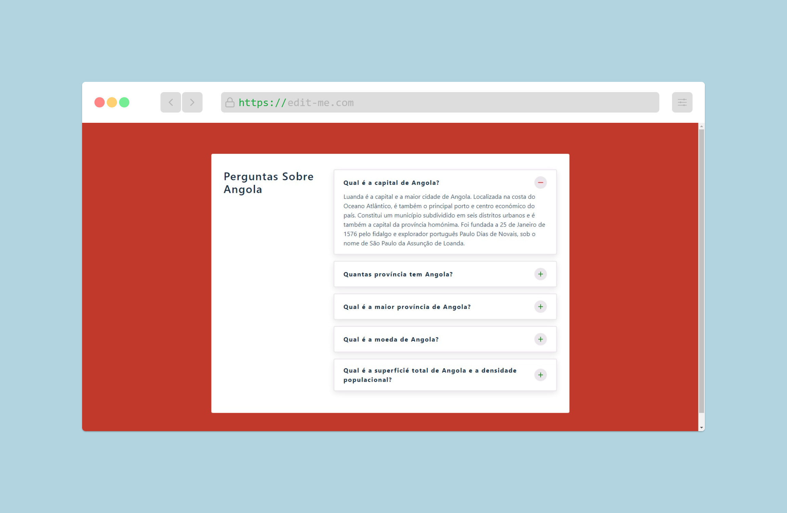

<h1 align="center">Angola accordion</h1>

  

 

This app was created with the intention no show up some curiosity about Angola.

<h1 align="center">
  
</h1> 

## Summary

  - [Begin](#Begin)
  - [Requirement](#Requeriment)
  - [Installation](#Installation)
  - [Test](#Test)
  - [Deploy](#Deploy)
  - [Pattern to follow](#Padrão-to-follow)
  - [Author](#Author)
  - [Useful technologies](#Useful-technologies)

## Begin

Follow the instructions below to run the app.

### Requirements

What you need to run.

* **[Node v13.8.0](https://nodejs.org/en/)** - Install Node JS in your machine.

### Instalation

- Install all the dependencies.

Execute

    npm install

Or

    yarn install

- Start the project.
 
    npm start

Or

    yarn start

Note: We recommend to use yarn rather than npm . 
### Test

Executes the test

    npmn test

## Deploy

The deployment...

## Pattern 

  - [Contributor Covenant](https://www.contributor-covenant.org/) 
 
## Author

  - **Mário Batalha**  -

## Technologies
  - JS
  - React
  - CSS3

